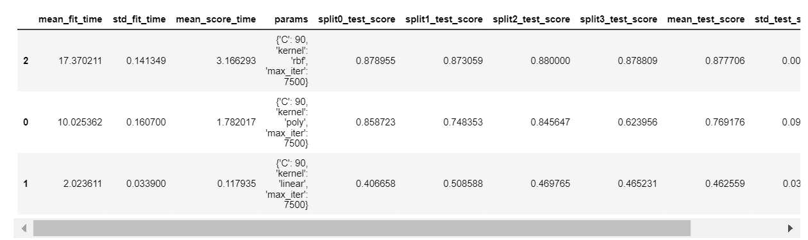
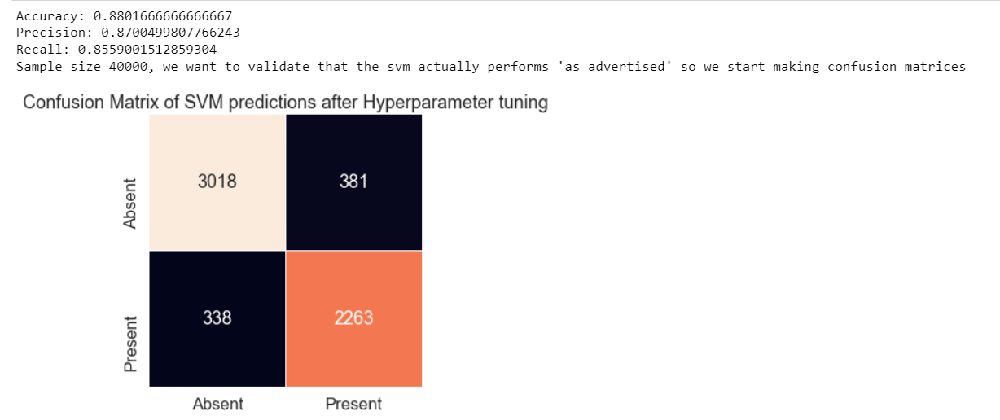

SVM vs Random Forest?
====================

This project is a Comparison of a support vector machine and a random forest classifier on the same dataset: the BNG_Heart_Statlog data from openml, containing one million entries  of 13 features and a 14th "class" column. It is a python built project using jupyter notebooks. The necessary enviornment can be built from the heart_statlog.yml file included. Aim to classify heart disease Absence/0 or Presence/1 

The Process
---------------
#### Initial Visualizations
We take an initial gander at the dataset and observe 13 features as input, leading to a binary classification: the presence or absence of heart disease. We can see that all of our input data is numerical, but our output data is categorical and of type string.

 

We can easily fix this problem by using a nominal converter so that we get a numerical and binary output instead. This looks as follows:

After we've done our initial exploration, we continue by looking at just some visualizations of what we think are important relationships. In this case, we look at the distribution of ages among both classes. Here we can see that, although not a deciding factor, the age distributions of both classes are, in fact, slightly different. We can also see that the spreads of resting heart rates are similar among both classes.

 

#### Model Selection
After this, I decided on the models that I wanted to compare for this particular dataset. Even though neural networks have had remarkable success classifying similar data, I wanted to try machine learning models that I was unfamiliar with, and so I chose to look at SVM's and Random Forests. 
- SVM's because they have the ability to learn nonlinear relationships between features using kernel methods and for the same reason, we can test it earlier without having to preprocess our data excessively.
- Random Forests because if the relationships are not of high order, the model will perform better, train faster and scale to a larger subset of the data with more accuracy.

#### Model Training
As mentioned previously, we could use the SVM 'kernel trick' to predict with almost no data preparation. And we can see below that after only a only a few tuned hyperparameters. The SVM already classifies the small subset with high accuracy. Below is the confusion matrix with 20000 samples and a radial basis function kernel.

 

#### Hyperparameter Tuning
In this section, we will describe a series of concise steps taken in an attempt to increase the model accuracy and scale it to the desired size of one million entries (the entire test set). I used the parameters in the best trainings to fine tune my svm for the following group of trainings. For this, I made great use of the _GridSearchCV_ library and greatly appreciate the efficiency that it granted the workflow in this project through automation; For simple machine learning tasks, I highly recommend it.  In any case: the steps (almost all of them, at least) we followed for tuning were as follows:

- We increased the sample size from _20000 to 40000_ and added the default _3rd degree polynomial_ kernel to our kernel searchspace parameters. We used a _slack variable selection of 10, 50 and 100_ as well as a selection of _1k, 5k and 10k for maximum number of iterations. We started the tuning by using a _2 fold cross validation_ in our grid search. Training time: 5 min, 46 s.

- From these results we increased the resolution of the _slack variable to go from 10-100_ in increments of 10, and changed the _max iterations to 5k, 7.5k, and 10k_. Training time: 23 min, 18 s.

- Then we increased _2 fold validation to 3 fold validation_ in an attempt to check for overfitting, _slack of only 90, iterations of 7.5k_. Training time: 2 min, 10 s.

- Added 'linear' kernel to search space parameters and went up to _4 fold_ validation. Training time: 2 min, 46 s.

- Removed 'linear' and 'poly' kernels from search space parameters and added sigmoid also to check. Confusion matrix and classification report to "see if model performs as advertised". Training time: 4 min, 12 s.

