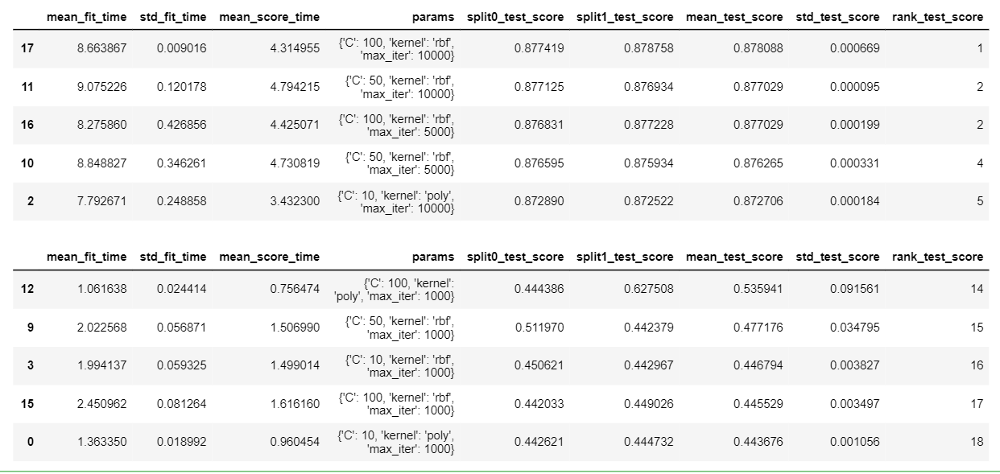
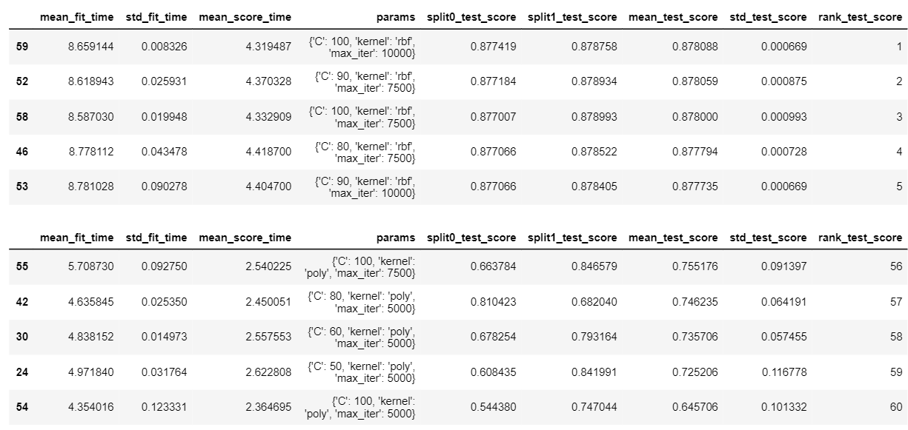
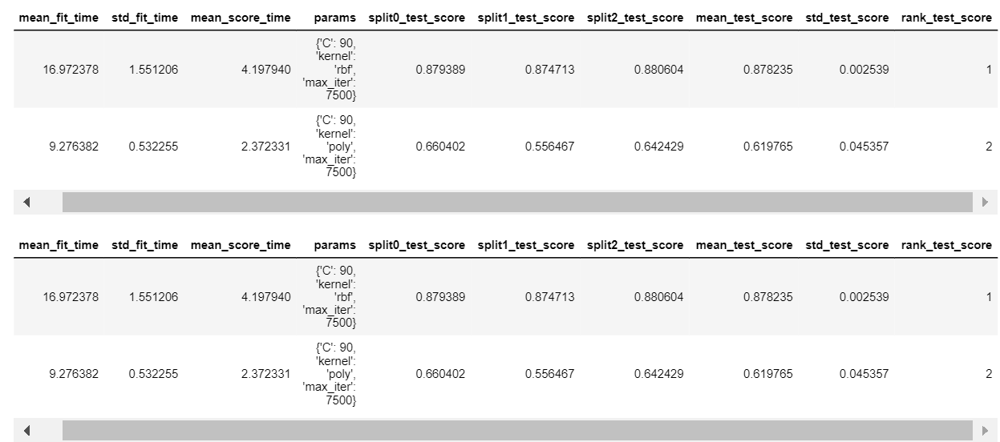
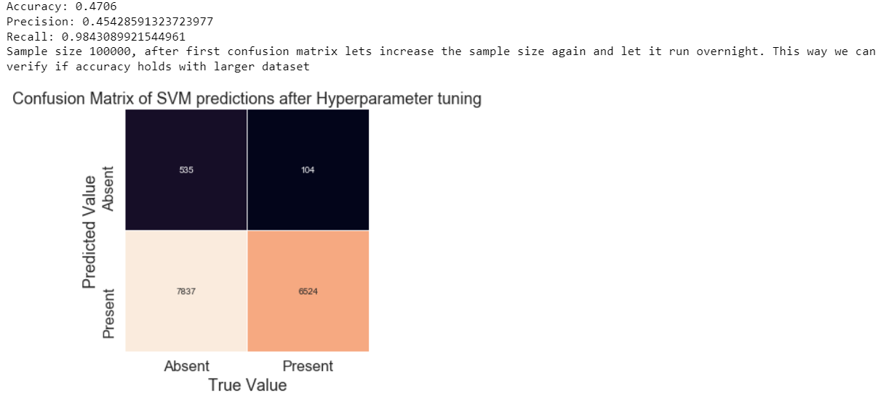
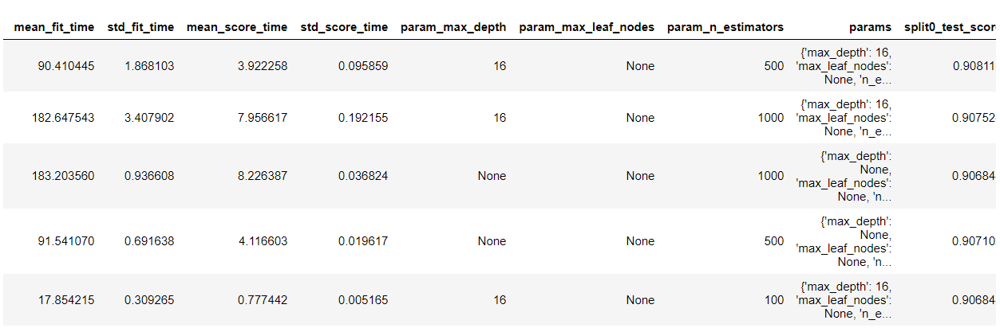
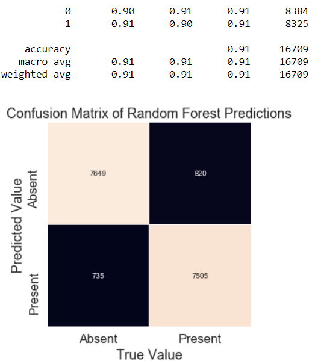
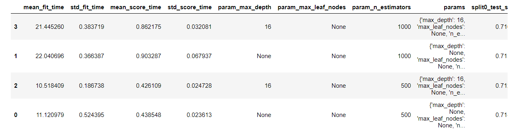
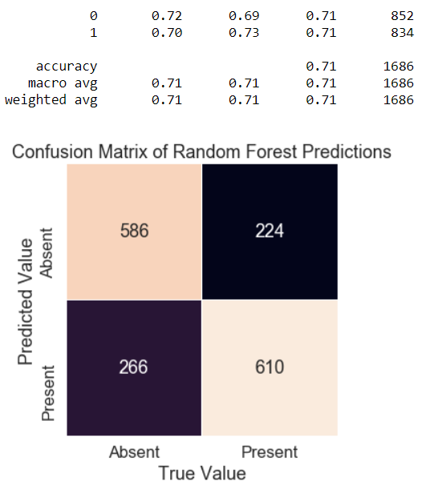
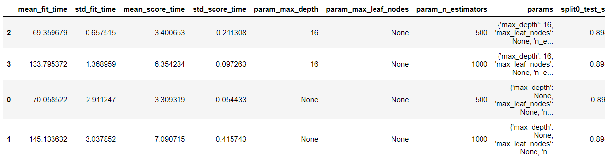
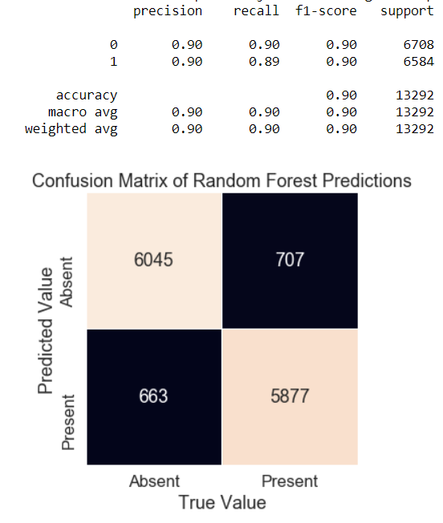

SVM vs Random Forest?
====================
C. Augusto Suarez: University of New Brunswick, Dec 2019
----------

This project is a Comparison of a support vector machine and a random forest classifier on the same dataset: the BNG_Heart_Statlog data from openml, containing one million entries  of 13 features and a 14th "class" column. It is a python built project using jupyter notebooks. The necessary enviornment can be built from the heart_statlog.yml file included. Aim to classify heart disease Absence/0 or Presence/1 

The Process
---------------
#### Initial Visualizations
We take an initial gander at the dataset and observe 13 features as input, leading to a binary classification: the presence or absence of heart disease. We can see that all of our input data is numerical, but our output data is categorical and of type string.

 

We can easily fix this problem by using a nominal converter so that we get a numerical and binary output instead. This looks as follows:

After we've done our initial exploration, we continue by looking at just some visualizations of what we think are important relationships. In this case, we look at the distribution of ages among both classes. Here we can see that, although not a deciding factor, the age distributions of both classes are, in fact, slightly different. We can also see that the spreads of resting heart rates are similar among both classes.

 

#### Model Selection
After this, I decided on the models that I wanted to compare for this particular dataset. Even though neural networks have had remarkable success classifying similar data, I wanted to try machine learning models that I was unfamiliar with, and so I chose to look at SVM's and Random Forests. 
- SVM's because they have the ability to learn nonlinear relationships between features using kernel methods and for the same reason, we can test it earlier without having to preprocess our data excessively.
- Random Forests because if the relationships are not of high order, the model will perform better, train faster and scale to a larger subset of the data with more accuracy.

#### Model Training
As mentioned previously, we could use the SVM 'kernel trick' to predict with almost no data preparation. And we can see below that after only a only a few tuned hyperparameters. The SVM already classifies the small subset with high accuracy. Below is the confusion matrix with 20000 samples and a radial basis function kernel.

 

#### SVM Tuning
In this section, we will describe a series of concise steps taken in an attempt to increase the model accuracy and scale it to the desired size of one million entries (the entire test set). I used the parameters in the best trainings to fine tune my svm for the following group of trainings. For this, I made great use of the _GridSearchCV_ library and greatly appreciate the efficiency that it granted the workflow in this project through automation; For simple machine learning tasks, I highly recommend it.  In any case: the steps (almost all of them, at least) we followed for tuning were as follows:

- We increased the sample size from _20000 to 40000_ and added the default _3rd degree polynomial_ kernel to our kernel searchspace parameters. We used a _slack variable selection of 10, 50 and 100_ as well as a selection of _1k, 5k and 10k for maximum number of iterations. We started the tuning by using a _2 fold cross validation_ in our grid search. Training time: 5 min, 46 s.

- From these results we increased the resolution of the _slack variable to go from 10-100_ in increments of 10, and changed the _max iterations to 5k, 7.5k, and 10k_. Training time: 23 min, 18 s.

- Then we increased _2 fold validation to 3 fold validation_ in an attempt to check for overfitting, _slack of only 90, iterations of 7.5k_. Training time: 2 min, 10 s.

- Added 'linear' kernel to search space parameters and went up to _4 fold_ validation. Training time: 2 min, 46 s.

- Removed 'linear' and 'poly' kernels from search space parameters and added sigmoid also to check. Confusion matrix and classification report to "see if model performs as advertised". Training time: 4 min, 12 s.

- Here is where I wanted to see if the model would scale up. As such, I decided to _increase to sample size from 40000 samples to 100,000 samples_. and let it run over night. I was also using only 'rbf' for the kernel parameter and a slack variable selction of 80-100 in increments of 5. Training time: 33 min, 32 s.

#### Here we reach a point where we need to do some more work before we can continue scaling

We can see that the increase in samples fed into the SVM training drastically took a toll on our accuracy metrics. This happens because as our training data increases, so do our number of support vectors, meaning that our classification boundaries have a harder time generalizing to unseen data. To attempt to fix this, I tried several approaches separately and in a pipeline.
- The first thing I tried was a simple normalization: Every data point was normalized to mean 0 and standard deviation 1.

- When this failed to make a noticeable impact, I looked at principal component analysis and attempted to train on the new transformed, pca-fit data. I also tried tuning the number of iterations that the PCA did on the data.

- When PCA filled, I tried undersampling AND oversampling techniques to see if it was an class imbalance problem. For undersampling I used random undersampling, which takes a random subset of the _majority_ class of equal size to the under-represented class to account for the imbalance. For oversampling, I used scikit-learns implementation of **S**ynthetic **M**inority **O**versampling **TE**chiniques (SMOTE) and applied it to the _minority_ class. This technique uses points in the minority class, calculates a difference vector to each of its K-nearest neighbors, then creates a new data point somewhere along the axis using the product of the difference vector and a random number between 0 and 1.

No combination of these techniques produced more adequate results, so I turned my attention to my second machine learning algorithm: the **Random Forest Classifier**.

#### Random Forest Tuning
- After the initial tuning stages of the random forest, I arrived suprisingly quickly at an acceptable classifier for a _sample size of 10000_ with smote upsampling and _a 4-fold cross validation_.

- Maintaining the upsampling technique, I scaled the sample size from _10k to 100k samples_ and wanted to see how our new classifier would perform at the same size that our SVM went awry. In our search space, we used _100, 500, and 1000 as our number of estimators_, we used _None (Default), 16, and 64 as our max leaf nodes_ and _None (Default, 8 and 16) as our max depth parameter_. Essentially I wanted to see if there was a way that we could maximize our accuracy metrics while using effective parameters for a shorter training time.

- From the results above, I noticed that increasing the estimators from 500 and 1000 had no real impact on accuracy but doubled our training time. As such, I decided to see if I could improve the estimator on streamlined parameters by running the same training on  the _PCA-fit-transformed_ data. My streamlined parameters were _n_estimators: 500, 1000 (honestly probably just forgot to remove the 1000)_ and _max depth 16 and None_. Training time: 3 min, 28 s

- I also in parallel ran a training with the same search space but _without PCA_ and with _downsampled_ data. The results were inline with the non-pca results with upsampling from the step above. Training time: 32 min, 32 s

**Note: with the same parameters, PCA (as expected) ran in a MUCH faster training time, but had a drastic loss in accuracy, so the time gain is less enticing.**

- Now the big one: I let the model sit overnight with our streamlined parameters {'n_estimators' : [500], 'max_leaf_nodes' : [None], 'max_depth' : [16] } and on the entire dataset (minus 10, actually, for a reason that will be explained later). Training time: 2 hours, 13 min, 38 s.

The Results
--------

The final random forest model performs well over my desired target (80%) and was able to scale to the entire 1 million data points! It trained in a very reasonable time and generalized well to our hold out sets over 4 Fold Cross Validation. With more data preparation and tuning I am sure that I could achieve an even better result. But this is satisfactory for now.

One More Thing
---------
Remember those last 10 data points that I held out from our dataset? I wanted to to see, if I took the last 10 points and laid out their ground truths, what the model would predict about them. This was more of a whimsical excercise than an actual motivated research technique, but it was still an interesting thought. The results are below:

As was expected with a 90% model, the random forest classifier correctly categorized 9 out the 10 last data entries. And with that, I conclude my first investigation on the heart_statlog dataset. But now it's obvious that I should ask: what else could I do? Well, with the work that's already been done, I can think of a few things that might improve our random forest classifier:
- cleaning our data with other techniques
- seeing what techniques like varimax rotation could do to our PCA's. For that matter, seeing how we could take advantage of the PCA's in any way! Seeing as the drastically decreased our training time
- Trying other sampling techniques such as ADASYN or maybe a _non_-random undersampling
- Running a slightly modified random forest algorithm, such as a boosted tree

Maybe I'll come back to this at a later stage but for now, these results suffice.
